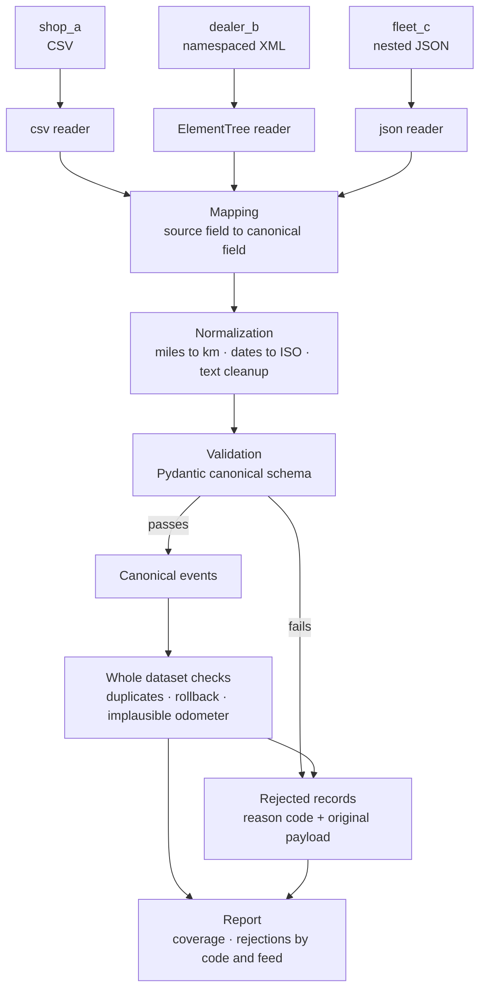

# PLAN.md: design and build plan

How this project is put together, what the MVP does, and what the later phases would do. The
README says what is built. This file says what it is meant to become.

---

## 1. The problem

Vehicle service data is fragmented. The same event, "replaced front brake pads", arrives from an
independent shop as a CSV row, from a dealership as a job inside a namespaced XML repair order, and from a fleet provider as a record in a JSON export. Field names differ, dates
come in three formats, the odometer is sometimes miles and sometimes kilometres, and the work
description is free text written by whoever closed the repair order.

Mapping the well formed records is the easy half. The half that decides whether the result can be
trusted is what happens to the rest: a VIN with 16 characters, a date that says `pending`, an
odometer reading lower than last year's, the same repair reported twice by two systems. Those
records have to be caught, given a reason, and counted by cause, because a cause that is counted
can be fixed and a record that is silently dropped cannot.

## 2. Scope

The project is built in phases. Phase 1 is the MVP and is the only phase with code.

**Phase 1, the MVP:**

1. Read three feeds with three different parsers.
2. Map every source field to one canonical schema, converting units and dates.
3. Validate every mapped record against the schema.
4. Send what fails to a rejected-records table with a reason code, the detail in words, and the
   original payload.
5. Run the checks that need the whole dataset: duplicates across feeds, odometer rollbacks,
   implausible jumps.
6. Print a report: records read, records mapped, records rejected by reason code and by feed.

**Phases 2 to 5** are described in section 8. They are a design and nothing more.

## 3. Architecture of the MVP

## 4. The three feeds

All records are synthetic. The formats follow real specifications, cited in
`docs/SAMPLE_DATA.md`, and every defect in them is deliberate and listed there too.

| Feed | Format | What makes it awkward |
|---|---|---|
| `shop_a` | CSV, with the CARFAX service transfer column names | The odometer arrives as `21,000`, quoted because it contains the delimiter, its unit lives in a separate column and switches between `MI` and `KM`, the shop name is typed three ways, and fifteen of the twenty four columns have no canonical target |
| `dealer_b` | XML, STAR repair order element names | A default namespace that makes a naive path match nothing, jobs nested inside repair orders so one order produces several events, the unit as an attribute, and two competing free text fields per job |
| `fleet_c` | JSON, REST export | `odometer.value` changes type between records, being a number, a string with a comma, or `null`, and one date does not exist on a calendar |

## 5. The canonical schema

Specified in `docs/DATA_DICTIONARY.md` field by field, and implemented in `src/models.py` as a
Pydantic model.

Two principles shape it:

- **Provenance is kept, never overwritten.** The odometer is converted to kilometres, and the unit
  the source reported is stored next to it. The original description is kept alongside the
  normalized one. A mapping decision that cannot be traced back cannot be audited.
- **The schema is strict at the boundary.** An empty description is not an event with an empty
  string in it, it is a rejected record. A field name that does not exist in the schema is an
  error, not a value that quietly disappears.

## 6. Mapping rules

Each feed has a mapping specification: for every canonical field, which source field it comes from
and which conversions apply. The specification is data, separate from the code that reads the
files, so adding a fourth feed is mostly writing another specification rather than another parser.

The MVP keeps those specifications next to the code. Moving them into YAML files, so that a mapping
can be reviewed and changed by someone who does not read Python, is a small and planned step and is
listed in phase 2.

The full table of source field to canonical field, for all three feeds, is in
`docs/DATA_DICTIONARY.md`.

## 7. Rejected records

Nothing is dropped. Every record that cannot be mapped becomes a row with a reason code, a
readable detail, and the original payload attached.

| Code | Meaning | When it is found |
|---|---|---|
| `E001` | `INVALID_VIN_LENGTH` | while reading a record |
| `E002` | `INVALID_VIN_CHARS`, a VIN containing I, O or Q | while reading a record |
| `E003` | `INVALID_VIN_CHECKDIGIT`, fails the ISO 3779 check | while reading a record |
| `E004` | `MISSING_REQUIRED_FIELD` | while reading a record |
| `E005` | `UNPARSEABLE_DATE` | while reading a record |
| `E006` | `DATE_OUT_OF_RANGE`, a service date in the future | while reading a record |
| `E007` | `ODOMETER_ROLLBACK` | after all feeds are read |
| `E008` | `ODOMETER_IMPLAUSIBLE` | after all feeds are read |
| `E009` | `DUPLICATE_EVENT` | after all feeds are read |
| `E010` | `UNMAPPED_SOURCE_FIELD`, a source field with no canonical target | while reading a feed |

The last one is not about a broken record. It is about a source column nobody mapped, which is the
quiet way data goes missing: the file arrives complete, the pipeline reads what it recognises, and
nobody notices the rest. Reporting it turns an unnoticed gap into a decision.

**The ISO 3779 check digit** is the arithmetic behind `E003`. Position 9 of a VIN is a checksum
over the other sixteen characters: letters are transliterated to numbers, each position has a fixed
weight, the weighted sum is divided by eleven, and the remainder is the digit, written as `X` when
it is ten. It catches a single wrong character and a transposition of two adjacent ones, which are
the two mistakes a person makes when copying a VIN by hand.

## 8. Phases after the MVP

Design only. No code exists for any of this.

**Phase 2, service taxonomy and classification.** A two level taxonomy of service categories, from
system down to component, with its own codes. Free text descriptions are classified into it by
keyword and pattern matching, and each result carries a confidence. Descriptions the rules cannot
place with confidence are held for review instead of being guessed. The taxonomy is modelled on the
shape of the VMRS hierarchy, which is a standard licensed by TMC and ATA; its official code set is
not reproduced here. This phase also moves the mapping specifications into YAML files.

**Phase 3, VIN decoding.** Valid VINs are sent to the free NHTSA vPIC service to resolve make,
model and model year, and every response is cached on disk so that reruns work offline. The metric
is the decode rate, and improving it is the point: handling the `O` for `0` substitution and
adjacent transpositions recovers records a strict parser drops.

**Phase 4, human review.** A small interface listing the records the rules were unsure about, with
the proposed category and its confidence. A person approves, corrects or rejects, and every
decision is stored, so the disagreement between the rules and a person becomes measurable instead
of anecdotal.

**Phase 5, packaging.** A Dockerfile, so the pipeline runs the same way on a machine that is not
this one.

## 9. What this project deliberately does not do

- No orchestration engine, no message queue, no distributed compute and no warehouse. The dataset
  is 97 records and fits in memory.
- No real customer data.
- No machine learning in the MVP. A keyword rule that reaches the same accuracy as a model is
  cheaper, explainable and easier to correct, so the rules come first and anything else has to beat
  them on the same data before it earns a place.
